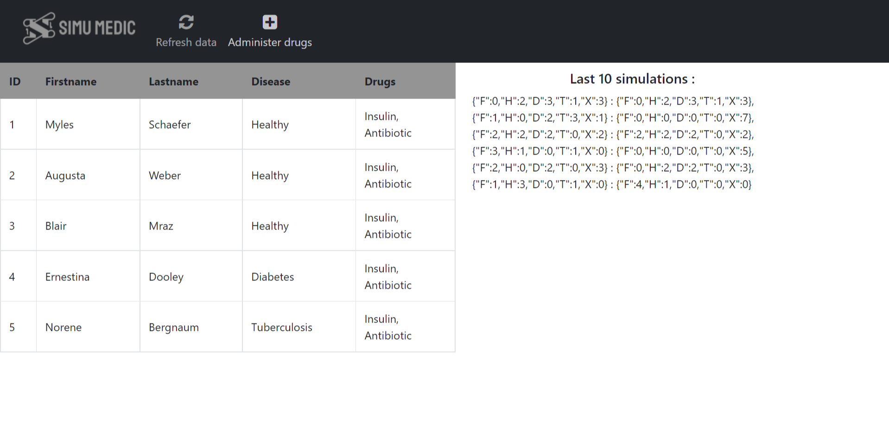

<br />
<p align="center">
  <a href="https://github.com/Thibault-collard/hospital_simulator">
    
  </a>

  <h3 align="center"> Simu Medic</h3>

  <p align="center">
    Application test for the position of Fullstack developer at Propulse Lab, a start-up incubator and services company for marketing start-up.
		<br />
    <br />
    <a href="https://github.com/Thibault-collard/hospital_simulator/issues">Report a Bug</a>
    <a href="https://github.com/Thibault-collard/hospital_simulator/pulls">Suggest a modification</a>
  </p>
</p>

<!-- ABOUT THE PROJECT -->
## About this projet

You were asked by a doctor friend to prepare for her a “Hospital simulator”, which can simulate the future patients’ state, based on their current state and a list of drugs they take. Patients can have one of these states:

F: Fever
H: Healthy
D: Diabetes
T: Tuberculosis
X: Dead

In the “Hospital simulator” drugs are provided to all patients. It is not possible to target a specific patient. This is the list of available drugs:

As: Aspirin
An: Antibiotic
I: Insulin
P: Paracetamol

Drugs can change patients’ states. They can cure, cause side effects or even kill a patient if not properly prescribed. Drugs effects are described by the following rules:

- Aspirin cures Fever;
- Antibiotic cures Tuberculosis;
- Insulin prevents diabetic subject from dying, does not cure Diabetes;
- If insulin is mixed with antibiotic, healthy people catch Fever;
- Paracetamol cures Fever;
- Paracetamol kills subject if mixed with aspirin;

### Built with

* Node JS (Back-end)
* Vue JS (Front-end)
* Typescript
* Bootsrap (Library Front-end)

### Pre-requisite

To understand this project more deeply, you need have basic fondations in Typescript, Javascript and Vue JS

```

### Installation

1. Clone the repo
```sh
git clone https://github.com/Thibault-collard/hospital_simulator.git
```
2. Instal NPM packages
```sh
npm install
```
3. Start the app
```sh
npm run start
```

To replicate this project, you don't need any type of credentials

<!-- USAGE EXAMPLES -->
## Skills used 

- Create an algorithm to simulate the state of the patients
- Running set of tests to ensure that app is running well
- Create front-end to display data of patients
- Store data into localstorage 

<!-- ROADMAP -->
## Project Structure

FRONT (hospital-fe/src folder):
-> In Component folder : 
- 'Grid_patients' is the main page of the page with navbar and table, 
- 'NavSimu' is the navbar of the application
- 'TableLite' is the model used to write the table of data

BACK (hsopital-lib folder):
-> In table folder
- 'drug' with the description of each drugs
- 'disease' with the description of diseases and side effects

-> In Src folder
- 'utils' to store all functions reusable for other development
- 'healing' is the main process used to process the treatment
- 'formatInput' help to structure the data receive from server (from String to Array)
- 'quarantine.spec' is the list of tests related to the algorithm treatment
- 'patientRegister' is the interface use in constructor at the start point and endpoint
- 'index' is the summary of the main methods : setDrugs (format drugs array properly), wait40days (administer drug to patient), report (display result of treatment)

-ROOT:
- 'index' to load express server with few routes to simulates list of patients and list of drugs

<!-- LICENSE -->
## Licence

This folder and all of the code it contains is freely accessible, without the need for attribution. But remember that copying without understanding will not advance your skills.

<!-- CONTACT -->
## Contact

For all requests: thibault.collard@gmail.com


